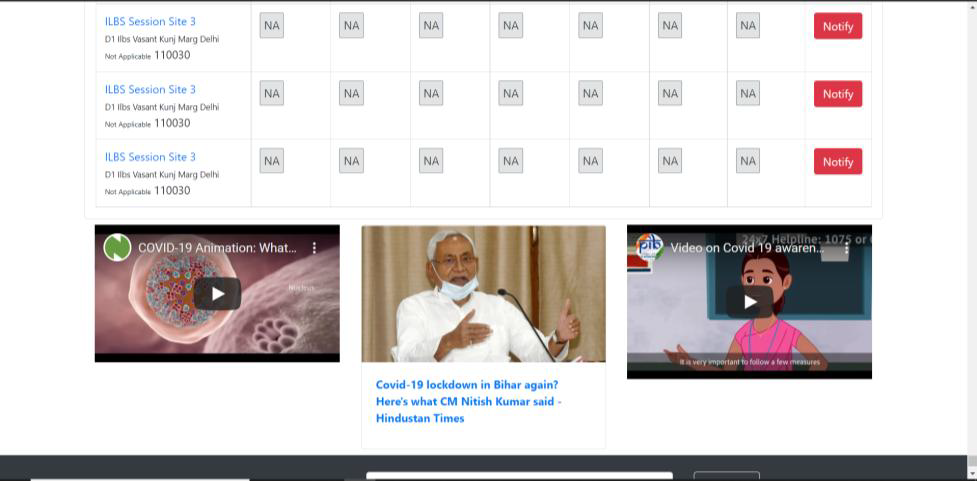
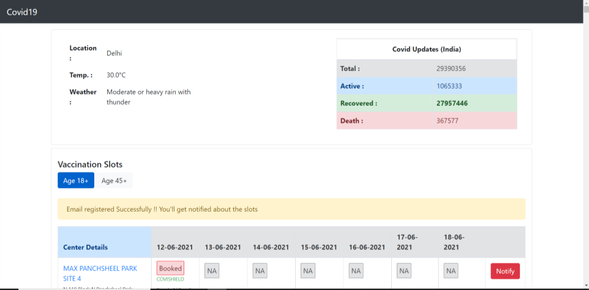
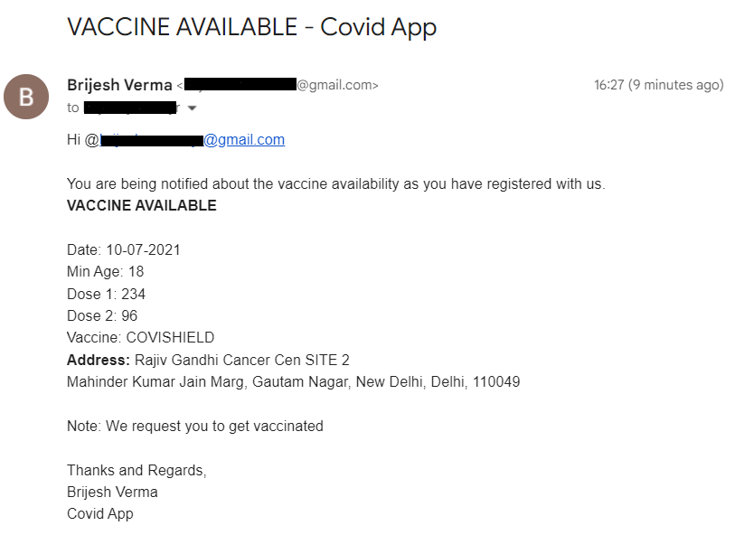

# **COVID APP**

COVID APP is a comprehensive web application designed to provide real-time updates on the COVID-19 situation across India. This project serves as a centralized platform for tracking various crucial aspects related to the pandemic, including the current status of COVID patients, weather information based on selected locations, COVID-related news, and vaccination slot availability.

## Key Features

1. **Current COVID Status**: Users can stay informed about the total number of cases, recoveries, active cases, and deaths nationwide.
2. **Weather Information**: By selecting their location, users can access real-time weather updates and temperature data.
3. **Daily COVID News**: Stay updated with the latest news articles related to COVID-19 published on the selected day.
4. **Vaccination Slot Availability**: Users can search for vaccination centers by state and district, view center details, and check the availability of vaccine slots according to age groups. Additionally, users have the option to register their email address for notifications on slot availability.

## Prerequisites

- JAVA 
- Spring Framework
- Spring MVC
- Spring Boot
- Maven
- MySQL / H2

## Software Needed

- Eclipse / STS / IntelliJ

## APIs Used

1. Weather (source: Rapid API): [Weather API](https://rapidapi.com/weatherapi/api/weatherapi-com)
2. Covid-19 (source: Rapid API): [Covid-19 API](https://rapidapi.com/api-sports/api/covid-193)
3. News (source: Newsapi.org): [News API](https://newsapi.org/)
4. Cowin (source: API Setu): [Cowin API](https://apisetu.gov.in/public/api/cowin)

## Steps to Import and Execute the Project

1. **Clone the repository:**
   - Open a terminal or command prompt.
   - Run the following command:
     ```
     git clone https://github.com/brijeshverma0007/covid-application.git
     ```
   - Change into the project directory:
     ```
     cd covid-application
     ```

2. **Import the project in Eclipse/STS/IntelliJ.**
   - Navigate to `File -> Import -> Browse -> Select Folder of project downloaded`.

3. **API Key Configuration**
   - Create an account on Rapid API and obtain the API_KEY for both Weather and Covid-19 APIs.
   - Paste the API_KEY in the `application.properties` file of `com.verma.covid.resources` package:
     - For Weather API:  `key.api.rapid = RAPID_API_KEY`.
   - Similarly, obtain the API_KEY from NewsAPI and paste it in the same class.
     - For News API: `key.api.news = NEWS_API_KEY`.

4. **Email Configuration**
   - Set the `email.from` variable in the `application.properties` file to your desired email address.
        ``

5. **Port Configuration**
   - Ensure that nothing is running on PORT 8080 of your computer. If it's busy:
     - Either stop your server of PORT 8080.
     - Or write the following in `application.properties`: `server.port = 8081` (or any other free port).

6. **Database Configuration**
   - Set the following configurations according to your system in `application.properties`:
     - `spring.datasource.url = jdbc:mysql://localhost:3306/covid`
     - `spring.datasource.username = YOUR_DB_USERNAME`
     - `spring.datasource.password = YOUR_DB_PASSWORD`
     - `spring.mail.username=YOUR_EMAIL_ID_BY_WHICH_YOU_WANT_TO_SEND_MAIL`
     - `spring.mail.password=PASSWORD_GENERATED`

7. **Create Database**
   - Create a database with the name `covid`. If you change the name, update it in `application.properties` as well.
   - Execute the query: `create database DB_NAME;`

8. **Table Creation**
   - There are two ways to create the tables in the Database:
     - Use query to create table with columns according to the provided DB structure.
     - For the first time change `spring.jpa.hibernate.ddl-auto` in `application.properties` to `create`. After running for the first time, change it back to `validate`.

9. **Run the Project**
   - **Using Eclipse/STS/IntelliJ:**
     - After importing the project, run it as a Spring Boot application.
     - Navigate to the project directory in Eclipse/STS/IntelliJ.
     - Right-click on the project -> Run As -> Spring Boot App.
   - **Using Maven Command Line:**
     - Open a terminal or command prompt window on your computer.
     - Change the directory to the root directory of your Spring Boot project where the `pom.xml` file is located.
     - Run the following Maven command to compile the project and package it into an executable JAR file:
       ```
       mvn clean package
       ```
     - Once the Maven build is successful, navigate to the `target` directory created inside your project directory.
     - You will find a JAR file named something like `covid-application-0.0.1-SNAPSHOT.jar`.
     - Run the JAR file using the following command:
       ```
       java -jar covid-application-0.0.1-SNAPSHOT.jar
       ```
10. **Access the Application**
   - Once the project is running, access the application in your web browser using the following URL:
     ```
     http://localhost:8080/index
     ```

## Screenshots of Project

### 1. Current COVID Status And Weather Info
<div style="display: flex;">
    
    
</div>

### 2. Vaccination Slot Availability And Covid News
<div style="display: flex;">
    
    
</div>

### 3. Register Email Address for Notifications
<div style="display: flex;">
    
    
</div>

### 4. Email Notification
<div style="display: flex;">
    
    
</div>


### License
This project is licensed under the MIT License - see the <a href = 'https://github.com/brijeshverma0007/covid-application/blob/master/LICENSE'>LICENSE file</a> for details.
